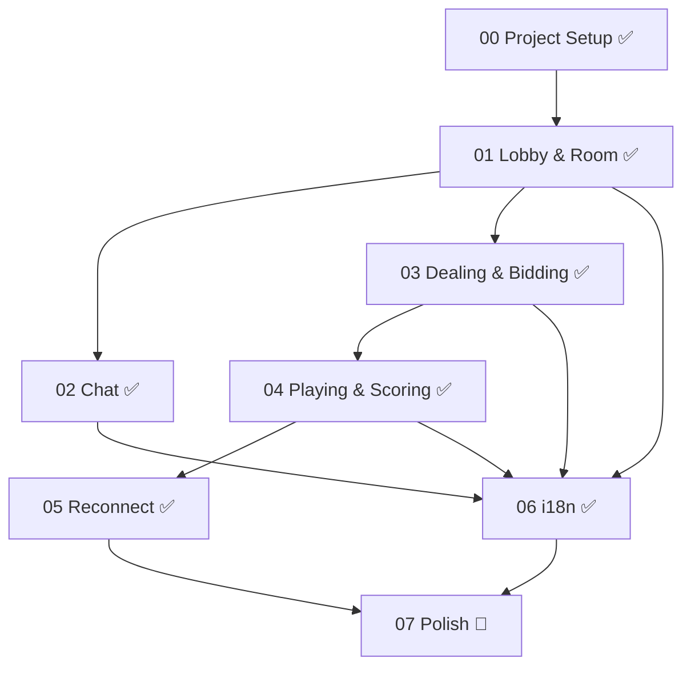

# Bridge Online — 工程進度總覽

> **最後更新**: 2026-10-03

## Original music catalog

- Expanded the synthesizer with evolving brightness, transient noise, delayed
  vibrato, and inharmonic bell resonance. Seven reusable Japanese instrument
  presets support new arrangements of all five Japanese tracks, preserving IDs.

- Added seven original instrumental loops spanning punk, kawaii EDM, ambient,
  chiptune, Celtic, Japanese-inspired, and house, followed by four more Japanese
  arrangements; the catalog now has 18 tracks, including five Japanese tracks.
- The additional arrangements contrast festival taiko, rainy-night plucked strings,
  a three-beat spring dance, and a quiet garden without percussion.
- Grouped the menu by genre with bilingual energy and BPM labels. Existing
  playback modes, volume persistence, and gesture-only playback remain available.
- Browser verification covered selection, playback, pause, next-track switching,
  and English genre labels. Audio tests cover all tracks for finite samples,
  audible levels, clipping, distinct output, and rendering performance.

## Turn notification sound

- Added an independent, persisted sound toggle in the music menu, enabled by default.
- Increased cue amplitude by approximately 6 dB without changing background music volume.
- Actionable local turns trigger a short two-note cue after browser gesture unlock;
  duplicate snapshots and stale locked turns do not replay the cue.
- Bridge cues wait for the completed-trick presentation. Muting, leaving the room,
  losing the turn, or unmounting cancels pending playback.
- Validation: 376 tests across 40 files, TypeScript, ESLint with zero warnings,
  and the production client build passed.

## Voice recovery, backgrounds, auction alignment, and card sizing

- Peer-specific voice errors and connection states replace stale global warnings;
  explicit rejoin and bounded stale-socket retries support refresh recovery.
- Browser checks with synthetic streams verified three-party RTP exchange and
  participant replacement. Cross-network relay configuration remains a separate
  deployment prerequisite when direct connectivity fails.
- Background uploads fit the Nginx body limit and the waiting table displays the
  saved personal background. Auction columns use actual caller seats and only
  the current auction state.

- Card sizes now adapt to table space and hand count. The table, four seats, and
  all hand cards remain inside the centre column without table or hand scrolling;
  short landscape layouts compact decorative seat elements.

- Completed bridge tricks remain visible for 1.5 seconds, including the final
  trick before scoring. History shows all four cards in play order and each winner.
- Waiting-room chat fills the remaining desktop height beside the table; mobile
  keeps a stacked layout. Table-only backgrounds sit beneath floating player labels
  and hands; chat and the option header retain their original theme surfaces.

- Validation: full TypeScript and ESLint checks, 357 application tests, 24
  deployment tests, and the `/bridge_online/` production build passed. Browser
  checks covered desktop/mobile layout, lead badge placement, completed-trick
  hold, and final-score history. Changes are built but not yet deployed.

## systemd deployment

- Moved HTTP redirects into `bridge-online-http.conf`; deployment migrates the
  exact legacy managed block and backs up/restores both protocol snippets.
  HTTPS proxy routes continue to remove the external `/bridge_online` prefix.

- Deployment health checks now wait for healthy JSON during backend startup and
  Nginx reload, including transient 404 responses, before deciding to roll back.

- Fixed first-install startup: reset failure counters only for failed units.
  Added regression coverage for unloaded, inactive, active, and failed units,
  including propagation of reset/start errors.

- Added `deploy/build.sh` and `deploy/deploy.sh` for validated artifacts and a
  single sudo-aware deployment command, including managed Nginx route updates,
  backups, configuration rollback, and health checks.
- Prepared Node 24 artifacts and passed 190 application tests, 19 deployment tests,
  shell syntax checks, and candidate Nginx validation using temporary TLS files
  and unprivileged ports. Root installation is performed by the user's script command.

- [x] Service installer, local proxy trust, and `/bridge_online/` routing; see the
  [deployment guide](../wiki/deployment.md).
- Verified: full typecheck, lint, 190 tests, root/subpath builds, shell and unit
  validation, isolated runtime startup, Nginx SPA/assets/API/cookie/WebSocket checks.
- Production deployment is operational: the public HTTPS health endpoint returns
  healthy JSON and the user confirmed functionality. The collaborative browser
  could not reach the isolated loopback preview. A reported voice connection warning
  has been analyzed; no voice behavior changes are included in this deployment task.

## 帳號與資料庫擴充

- [x] [08 — Accounts, Persistence, Profiles & Friends](./08-accounts-persistence-social.md)
- JSON 資料庫、SQL Repository 遷移介面、帳號 Session、暱稱／頭像、好友與持久對局紀錄已完成。
- 驗證通過：TypeScript、ESLint、122 個 Vitest 測試（14 個檔案）、前端正式建置；瀏覽器確認帳號／好友完整流程與 390px 帳號頁。
- 以下 Phase 00–07 統計保留原始計劃範圍；Phase 07 的其他視覺與整合工作仍獨立追蹤。

## 效能優化

- [x] [09 — 效能優化與功能保留](./09-performance.md)
- 已加入 Repository 索引、受影響 collection 複製、同房間快照與未改變 resume 省略寫入。
- 前端採用路由延後載入、精確 selectors 與相同快照去重；schema、既有 API、驗證和遊戲規則保留。
- 已驗證受影響玩家完整狀態等價、房間隔離、多分頁、真實斷線 / 重連寫入及既有瀏覽器流程。
- [效能 Wiki](../wiki/performance.md) 記錄資料集、前後數字與 benchmark 命令；最終整體檢查數量以當次執行輸出為準。

## 玩家個人頁與背景音樂

- [x] [10 — 玩家個人頁與背景音樂](./10-player-profiles-and-music.md) 的功能與回歸測試已實作。
- 個人頁公開五個身分欄位、提供好友操作及返回房間；音樂由使用者啟動、跨路由播放、僅保存本機音量。
- 驗證通過：159 個 Vitest 測試（18 個檔案）、TypeScript、ESLint 與前端正式建置。
- 瀏覽器確認自己 / 他人個人頁、好友操作、返回房間、390px 排版；音樂跨頁持續、暫停、靜音與重新整理後停止並保留音量。

## 牌桌語音與聊天

- [x] [11 — 牌桌語音、靜音與拒聽](./11-table-voice-chat.md)
- 同房間 WebRTC 語音、獨立麥克風靜音 / 拒聽及正式對局文字聊天已完成。
- 驗證通過：188 個 Vitest 測試（20 個檔案）、TypeScript、ESLint 與前端正式建置。
- 四個獨立瀏覽器 context 以模擬麥克風驗證實際四人音訊、跨頁 / 進入對局、文字聊天、390px 排版及退出清理。
- 跨 NAT 語音可能需要 TURN；環境設定與驗證範圍見[牌桌語音 Wiki](../wiki/voice-chat.md)。

---

## 依賴關係圖

---

## Component 進度

- [x] [00 — Project Setup](./00-project-setup.md)
- [x] [01 — Lobby & Room System](./01-lobby-room.md)
- [x] [02 — Chat System](./02-chat.md)
- [x] [03 — Game Engine: Dealing & Bidding](./03-game-dealing-bidding.md)
- [x] [04 — Game Engine: Playing & Scoring](./04-game-playing-scoring.md)
- [x] [05 — Disconnect & Reconnect](./05-reconnect.md)
- [x] [06 — i18n 多語系](./06-i18n.md)
- [ ] [07 — Visual Polish & Integration Testing](./07-polish.md)

---

## 任務統計

| Component | 子任務數 | 完成數 | 進度 |
|-----------|---------|--------|------|
| 00 Project Setup | 60 | 60 | 100% |
| 01 Lobby & Room | 52 | 52 | 100% |
| 02 Chat | 16 | 16 | 100% |
| 03 Dealing & Bidding | 60 | 60 | 100% |
| 04 Playing & Scoring | 40 | 40 | 100% |
| 05 Reconnect | 19 | 19 | 100% |
| 06 i18n | 17 | 17 | 100% |
| 07 Polish | 30 | 0 | 0% |
| **合計** | **294** | **264** | **90%** |

---

## 測試統計

完整測試目前共 188 項（20 個檔案）全部通過；下表為原始遊戲引擎測試明細。

| 測試檔案 | 測試數量 | 狀態 |
|---------|---------|------|
| `deck.test.ts` | 9 | ✅ |
| `dealing.test.ts` | 12 | ✅ |
| `bidding.test.ts` | 20 | ✅ |
| `playing.test.ts` | 18 | ✅ |
| `scoring.test.ts` | 7 | ✅ |
| **合計** | **66** | **全部通過** |
