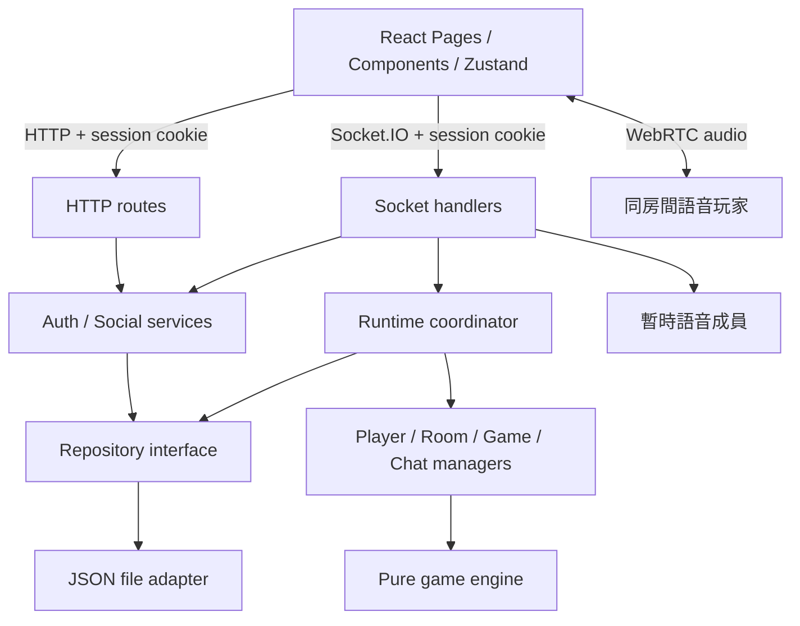

# 系統架構

> [返回目錄](./index.md) · [帳號與持久化儲存](./accounts-and-storage.md) · 更新：2026-10-03

## 高層架構

Production uses one systemd-managed backend and local Nginx for HTTPS and
`/bridge_online/` static, API, and WebSocket routing. Persistent data lives outside
the application tree. See [deployment](./deployment.md).

Bridge Online 是 TypeScript monorepo。React 前端透過 HTTP 管理帳號、好友與歷史紀錄，
透過已驗證的 Socket.IO 連線操作房間和遊戲。後端決定遊戲結果；前端顯示伺服器提供的狀態。

`shared/` 提供前後端共用的型別與遊戲常數。JSON 是目前的儲存實作，SQL adapter 為後續階段；
資料結構、交易要求與遷移步驟見[帳號與持久化儲存](./accounts-and-storage.md)。

## 模組職責與依賴

| 模組 | 職責與依賴 |
| --- | --- |
| `server/src/app.ts` | 組合 Express、Socket.IO、認證、HTTP routes 與 runtime，提供可關閉的應用程式 |
| `server/src/index.ts` | 讀取設定、開啟 JSON repository、啟動服務與處理正常關閉 |
| `http/` | HTTP payload、狀態碼、cookie 與服務呼叫 |
| `auth/` | 密碼驗證、session、profile、HTTP origin 與頻率限制 |
| `social/` | 好友申請和關係流程，透過 repository 進行原子狀態更新 |
| `socket/` | 認證連線、驗證 action、協調 manager、回覆 callback 與傳送玩家快照 |
| `runtime/` | 序列化遊戲異動、匯出與驗證快照、持久化和失敗回復 |
| `managers/` | 記憶體中的玩家、房間、遊戲、聊天狀態；提供匯出與還原 |
| `engine/` | 牌組、發牌、叫牌、出牌與計分純函式，只依賴 shared 型別與常數 |
| `database/` | 非同步 repository 合約、JSON schema 與具原子檔案替換的實作 |

Manager 不直接呼叫其他 manager。跨 manager 的操作由 Socket context 與 runtime coordinator
協調；遊戲 manager 呼叫 engine。Engine 不存取網路、資料庫或 manager。
模組使用函式與模組私有狀態，沒有自訂 class。

## 帳號與即時狀態

- 使用者名稱以小寫正規化作唯一查詢，帳號 ID 同時是玩家 ID。暱稱、顏色、頭像可以修改。
- 登入建立七天 session，瀏覽器以 HttpOnly cookie 傳送。Socket 握手與每個 action 都驗證 session。
- `player:resume` 回傳目前玩家、房間、本人可見的遊戲狀態與聊天紀錄。
- 成功異動後，伺服器只對操作者與受影響的舊 / 新房間成員發送 `player:state` 完整快照；每個帳號只收到自己的手牌與可出牌集合。
- 登出、登出所有裝置及變更密碼會撤銷對應 session 並中斷相關連線。
- 多個分頁共用同一帳號和座位。關閉一個分頁不會移除其他仍連線的分頁。

## 持久化流程

每個遊戲 action 依序執行：保存異動前快照、套用操作、保存 runtime 與新完成的對局結果，
成功後回覆 callback 並廣播。保存失敗會還原 manager 狀態，讓同一連線可以重試。
回復用快照獨立深複製；提交檢視在 runtime 佇列保護下交由 repository 複製和保存。
未改變 runtime 且沒有新完成對局的 resume、連線清理或 profile 同步可略過重複寫入，
仍保持認證與 callback 行為；首次附加玩家、最後分頁斷線和重連等真實變化仍保存。

帳號、session、好友、房間、準備狀態、私人手牌、遊戲進度與聊天紀錄都會保存。
重啟後已存在的玩家有新的 60 秒重連期限；超時離開會中止未完成對局。
完成的對局以穩定 game ID 保存到個人歷史，與 runtime 在同一次 repository 寫入中提交。
正常關閉會停止連線清理、關閉 Socket.IO 並等待待處理的寫入。

目前 manager 是單一程序內的共享狀態，JSON adapter 也要求一個檔案由一個伺服器程序使用。
資料庫備份與多程序擴充限制見[儲存說明](./accounts-and-storage.md)。

## 前端

`/login`、`/register` 提供帳號入口；`/`、`/account`、`/friends`、`/players/:accountId`、`/room/:roomCode`、
`/game/:roomCode` 需要登入。帳號頁可修改 profile、變更密碼、登出所有裝置與檢視完成對局。

`api.ts` 處理 HTTP 與 cookie，`socket.ts` 管理即時連線。
`use-account-connection.ts` 還原 session、訂閱 `player:state`，並將完整快照寫入 Zustand stores；
它取代原本的 `use-game-events.ts` 與 `use-reconnect.ts`。
Profile 頭像與暱稱用於導覽、好友清單、房間座位、遊戲與聊天。
UI 使用 CSS Modules；`i18n.ts` 與 `account-i18n.ts` 提供繁體中文、英文翻譯。
路由按需載入，snapshot stores 對相等欄位保留參照並略過重複通知，元件訂閱所需欄位。
Repository 索引、JSON 複製策略及量測結果見[效能與驗證](./performance.md)。

公開玩家頁使用獨立 HTTP 端點取得五個公開身分欄位，好友操作沿用既有 API。
`MusicControl` 在 `main.tsx` 的路由外掛載，首次播放手勢才配置可重用的 Web Audio 循環；
音量為本機偏好，每次頁面載入預設停止。詳見[玩家個人頁與背景音樂](./player-profiles-and-music.md)。

## 牌桌語音

`VoicePanel` 依實際房間身分按需載入，掛載於保護路由的頁面切換邊界之外。
同一房間切換等待室、對局或個人頁不重建通話；帳號 / 房間 / 連線變更會清理媒體。
`voice-session.ts` 管理主動授權的麥克風、最多三條遠端連線及各自的 SDP / ICE 佇列。
同一對 peer 由 ID 較小者發起 offer；靜音不改變 track 結構，也不觸發重新協商。

Server 的 `voice-manager.ts` 保存每個應用程式自己的暫時語音成員。
`voice-handler.ts` 驗證 payload 與 session，透過 runtime `inspect` 依序取得已提交房間身分。
房間修改的 `afterCommit` 在保存成功後、下一個排隊操作之前移除不再屬於房間的語音 peer。
語音訊息不觸發 JSON runtime 保存；原有寫入失敗回復仍保留。
音訊由瀏覽器直接交換，必要時使用部署者提供的 TURN；詳見[牌桌語音](./voice-chat.md)。
